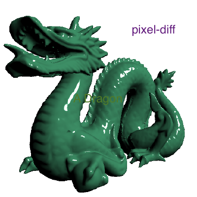

# pixel-compare
compare pixel of image for PNG, JPEG or DataURL.


example
-------
```js
const pixelCompare = require("pixel-compare");
pixelCompare({
    basedImage: "./test/test-images/dragon1.png",
    testImage: "./test/test-images/dragon2.png",
    outputImage: "./test/output-images/result.png"
})
.then(isSame => {
	//if two images are the same
});
```

If you want to compare multiple images to same based images, you can do this.
```js
const pixelCompare = require("pixel-compare");
pixelCompare({
	basedImage: "./test/test-images/dragon1.png"
})
.then(basedImageCompareable => {
	basedImageCompareable({
		testImage: "./test/test-images/dragon2.png",
		outputImage: "./test/output-images/result1.png"
	});

	basedImageCompareable({
		testImage: "./test/test-images/dragon3.png",
		outputImage: "./test/output-images/result2.png"
	});
});
```

| Base Image        | Test Image           | Result Image  |
| ------------- |:-------------:| -----:|
|       |  |  |

install
-------

```
npm insatll --save pixel-compare
```


api
------

### pixelCompare({ basedImage, testImage, [outputImage], [baseColor], [testColor] })

* `basedImage`: based image path or data url

* `testImage`: test image path or data url

* `outputImage`: is optional, output image path

* `baseColor`: is optional, array of 4 for base color when test color is all 0

* `testColor`: is optional, array of 4 for test color when base color is all 0

##### `return` a promise with a boolean to indicate if two images are the same.
